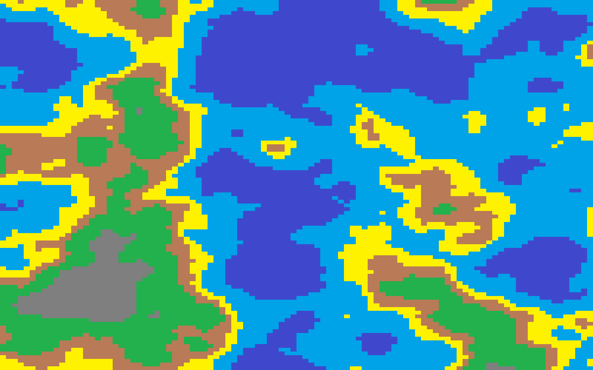

# theMapMonkey
small personnal project to experiment with procedural-generation and Perlin noise

 [](https://opensource.org/licenses/MIT)                    


## Installation

You'll need both [matplotlib](https://matplotlib.org/stable/users/installing/index.html) and [perlin_noise](https://pypi.org/project/perlin-noise/#description)

```bash
pip install -U matplotlib
pip install perlin-noise
```

## Usage
The map will be in the folder map.

```bash
python3.9 procedural-generation.py
```
You can change the texture of the tile in the tiles file
## Exemple:


## What's next :

I'm feeling like doing some turned base world simulation, so currently looking into it rn.
My current goal is to implement some kind of structure (maybe home that evolve into village into town ...) that evolve under certain condition to see the outcome.

Feel free to fork, raise an issue or even propose a fork I'll be glad to see someone continues my project.

Made with stress, coffee and love. (I swear i did not do this instead of my homework lol)

## License
Do whatever you want with this, it's on [MIT](https://choosealicense.com/licenses/mit/)
